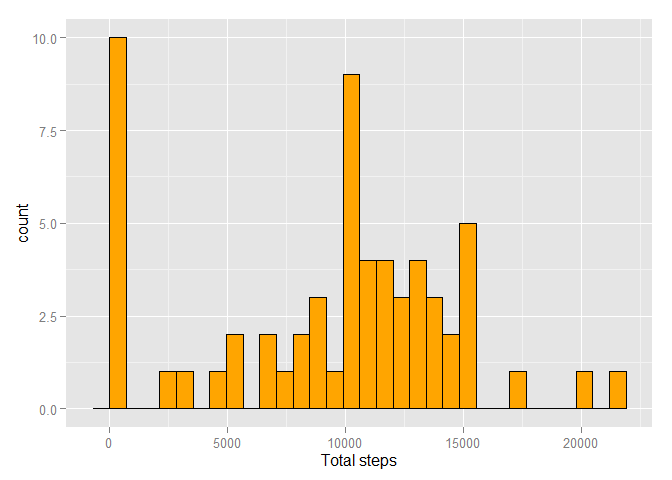
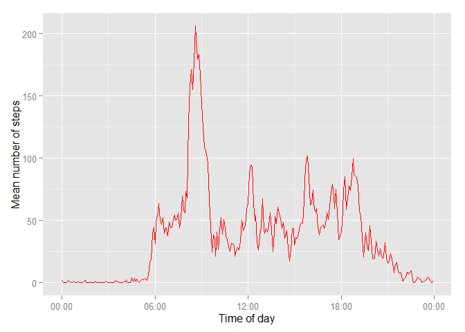
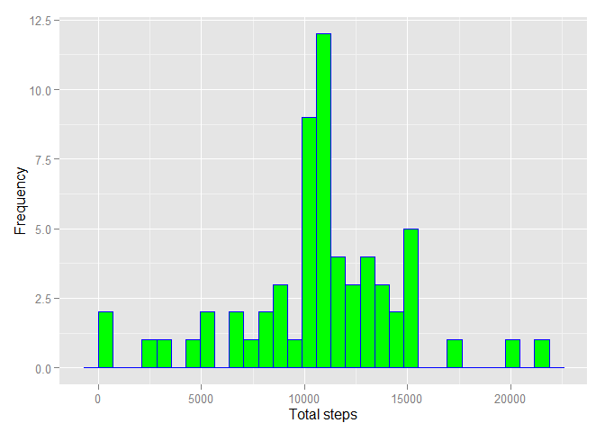
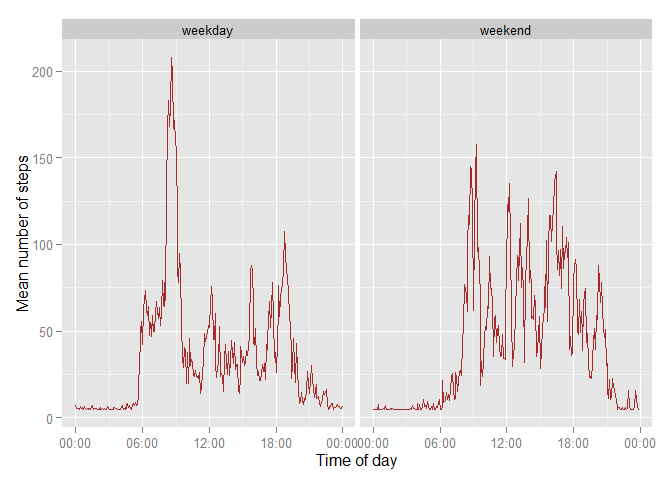

# Reproducible Research: Peer Assessment 1

## Loading and preprocessing the data

Unzip the folder - use 'Unzip()' function, read the data into a data frame 'DtFrmActivity'

```r
if(!file.exists('activity.csv')){
    unzip('activity.zip')
}
DtFrmActivity <- read.csv('activity.csv')
```

Create an 'dateandtime' column. This is a combination of the date and interval columns.

```r
acttime <- formatC(DtFrmActivity$interval / 100, 2, format='f')
DtFrmActivity$dateandtime <- as.POSIXct(paste(DtFrmActivity$date, acttime),format='%Y-%m-%d %H.%M',tz='GMT')
```

Create a column 'activitytime' just to hold the time of the day, this can be used for analysis of the  data pattern based on just the Time Part of the day

```r
DtFrmActivity$activitytime <- format(DtFrmActivity$dateandtime, format='%H:%M:%S')
DtFrmActivity$activitytime <- as.POSIXct(DtFrmActivity$activitytime, format='%H:%M:%S')
```

## What is mean total number of steps taken per day?

Calculate the mean steps for each day and assign it to a variable sumofsteps

```r
sumofsteps <- tapply(DtFrmActivity$steps, DtFrmActivity$date, sum, na.rm=TRUE)
```

Let's look at the mean and median for the total steps per day:

```r
mean(sumofsteps)
```

```
## [1] 9354.23
```

```r
median(sumofsteps)
```

```
## [1] 10395
```

Plot a histogram to observe the daily pattern


```r
library(ggplot2)
qplot(sumofsteps, xlab='Total steps',lab='Frequency', geom="histogram", fill=I("orange"),col=I("black"))
```

 


## What is the average daily activity pattern?

Calculate the mean for 5-minute interval.

```r
meansteps <- tapply(DtFrmActivity$steps, DtFrmActivity$activitytime, mean, na.rm=TRUE)
dailybreakup <- data.frame(time=as.POSIXct(names(meansteps)),
                            meansteps=meansteps)
```

Let's take a look at a time series plot for the mean steps.

```r
library(scales)
ggplot(dailybreakup, aes(time, meansteps)) + 
    geom_line(colour="red") +
    xlab('Time of day') +
    ylab('Mean number of steps') +
    scale_x_datetime(labels=date_format(format='%H:%M'))
```

 

Which five minute interval has the highest mean number of steps?

```r
mostmean <- which.max(dailybreakup$meansteps)
format(dailybreakup[mostmean,'time'], format='%H:%M')
```

```
## [1] "08:35"
```


## Imputing missing values
Use Summary command to get the count of 'NAs'

```r
summary(DtFrmActivity$steps)
```

```
##    Min. 1st Qu.  Median    Mean 3rd Qu.    Max.    NA's 
##    0.00    0.00    0.00   37.38   12.00  806.00    2304
```

Calculate the mean for 5 minutes interval

```r
#Supress Start Messages while loading the library
suppressPackageStartupMessages(library(Hmisc))
DtFrmImputedValues <- DtFrmActivity
DtFrmImputedValues$steps <- with(DtFrmImputedValues, impute(steps, mean))
```

Comparing the mean and median for 'activity frame' and  the 'activity frame with imputed values'.

```r
sumofstepsimputed <- tapply(DtFrmImputedValues$steps, 
                              DtFrmImputedValues$date, sum)
mean(sumofsteps)
```

```
## [1] 9354.23
```

```r
mean(sumofstepsimputed)
```

```
## [1] 10766.19
```

```r
median(sumofsteps)
```

```
## [1] 10395
```

```r
median(sumofstepsimputed)
```

```
## [1] 10766.19
```

Draw a Histogram.

```r
qplot(sumofstepsimputed, xlab='Total steps', ylab='Frequency', geom="histogram", fill=I("green"),col=I("blue"))
```

 

Imputing the missing data has increased the average number of steps. 

## Are there differences in activity patterns between weekdays and weekends?

Add a factor column to identify if it is a weekday or weekend.

```r
typeofday <- function(date) {
    if (weekdays(date) %in% c('Saturday', 'Sunday')) {
        return('weekend')
    } else {
        return('weekday')
    }
}

WeekdayWeekend <- sapply(DtFrmImputedValues$dateandtime, typeofday)
DtFrmImputedValues$typeofday <- as.factor(WeekdayWeekend)
```
Create a dataframe that holds the mean steps for weekdays and weekends.

```r
MeanStepsWkDayWkend <- tapply(DtFrmImputedValues$steps, 
                     interaction(DtFrmImputedValues$activitytime,
                                 DtFrmImputedValues$typeofday),
                     mean, na.rm=TRUE)
weekdayweekendpattern <- data.frame(time=as.POSIXct(names(MeanStepsWkDayWkend)),
                             MeanStepsWkDayWkend=MeanStepsWkDayWkend,
                               typeofday=as.factor(c(rep('weekday', 288),rep('weekend', 288))))
```


Comparision of Weekday and Weekend pattern

```r
ggplot(weekdayweekendpattern, aes(time, MeanStepsWkDayWkend)) + 
    geom_line(colour="brown") +
    xlab('Time of day') +
    ylab('Mean number of steps') +
    scale_x_datetime(labels=date_format(format='%H:%M')) +
    facet_grid(. ~ typeofday)
```

 


